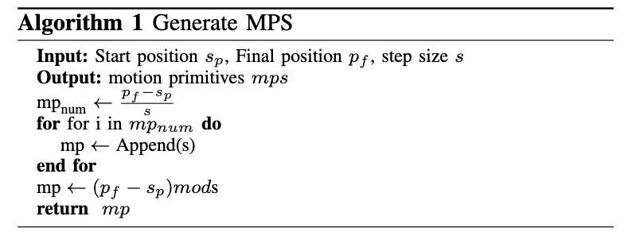
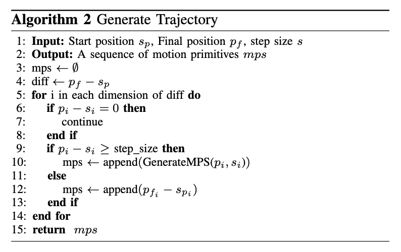

# HIRO_Robotic_Assisted_Feeding_Project
Human Interaction and Robotics Group (HIRO) project repository maintained and developed by Ava Abderezaei, Caleb Kumar and Noah Liska.

## Overview
Planning trajectories under complex dynamic constraints is computationally expensive and time-consuming. 
Hence, employing these dynamic constraints in motion planning, renders practical real-time motion planning unachievable. 
In this project, we propose a method to generate trajectories for systems with complex dynamics without explicitly 
using the dynamics. We specifically focus on the problem of robot-assisted feeding using a spoon. 
To that end, we generate spill-free motion primitives and then use these primitive motions
to generate a spill-free trajectory. Additionally, by implementing our proposed method on top of an optimization solver,
it can work in real-time. This is specifically important in assisted-feeding settings, 
as the robot should be able to react to environmental changes in real-time. 
To that end, we formalize a safe zone for the robot to enter when the user is distracted during the feeding process. 
We evaluate our approach on a panda robotic arm and achieve a spill-free trajectory
over different foods including sugar, peas, and yogurt.

## Algorithm

